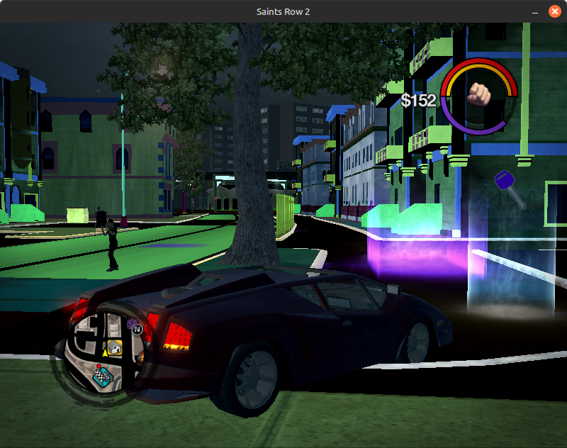

# Chunk Mangler

Chunk Mangler is a platform for performing bulk actions on chunk files. This can be useful for figuring out what unknown fields do, or for modding chunks. 

Example: randomized shader constants result in weird colors and stuff.

## Usage

The mangler isn't a complete application, but a base to build scripts on top of. The base takes care care of tedious and uninteresting parts like deserializing the file and saving the result, while the user writes the actualy operations to perform on the chunk. It doesn't use anything from Godot or Chonker, and compiles into a standalone CLI program.

Use [sr2_types](../sr2_types/) crate as reference.

Have a look at the `do_things()` function in [./src/main.rs](./src/main.rs). Edit that to change whatever fields you're interested in.

**Requirements:**  
- [Rust programming language](https://www.rust-lang.org/)

**Steps:**  

1. Make your changes
2. Build & run: `cargo run -- -p <path-to-chunkfile>`

    (in the chunk_mangler folder)

    

 Explanation 

    
    - `cargo run` Build and run the code
    - `--` Args after this are passed to the compiled program instead of the compiler
    - `-p` Mangler arg: input filepath.

    

3. Resulting chunk should appear in ./mangled dir.
4. Try your modified chunk in the game  
    The fastest way to try out a chunk is probably to install it with GOTR. 

## Development
TODO: auto-pack and launch the game